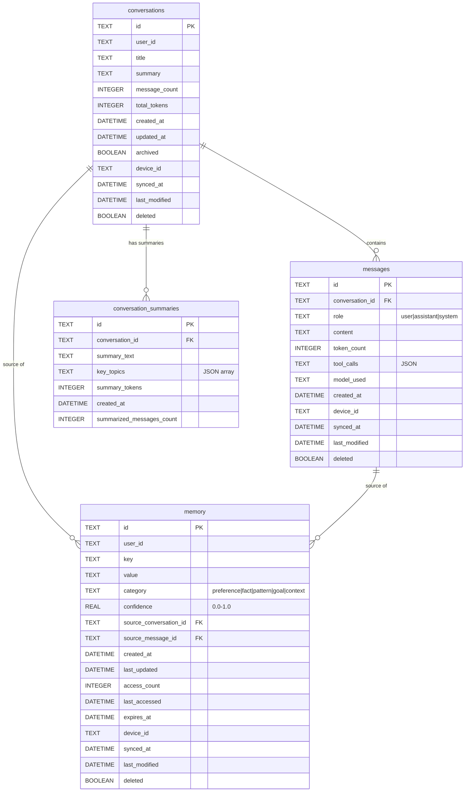

# FocusFlow Chat Schema - Entity Relationship Diagram

## Mermaid ERD



## Table Relationships

### conversations → messages (1:N)
- **Relationship**: One conversation contains many messages
- **Foreign Key**: `messages.conversation_id` → `conversations.id`
- **Cascade**: DELETE CASCADE (when conversation deleted, messages deleted too)
- **Bidirectional Navigation**: Yes
  - Get conversation → Get all messages: `get_messages_for_conversation(conv_id)`
  - Get message → Get conversation: `get_conversation(msg.conversation_id)`

### conversations → conversation_summaries (1:N)
- **Relationship**: One conversation can have multiple summaries over time
- **Foreign Key**: `conversation_summaries.conversation_id` → `conversations.id`
- **Cascade**: DELETE CASCADE
- **Use Case**: Incremental summarization as conversation grows

### conversations → memory (1:N, optional)
- **Relationship**: Memory can optionally track source conversation
- **Foreign Key**: `memory.source_conversation_id` → `conversations.id`
- **Cascade**: SET NULL (memory persists even if source deleted)
- **Use Case**: Traceability - where was this fact learned?

### messages → memory (1:N, optional)
- **Relationship**: Memory can optionally track source message
- **Foreign Key**: `memory.source_message_id` → `messages.id`
- **Cascade**: SET NULL
- **Use Case**: Fine-grained traceability to exact message

## Index Strategy

### conversations Indexes
```sql
-- Get recent conversations for user
idx_conversations_user_updated(user_id, updated_at DESC) WHERE deleted = 0

-- History view (non-archived)
idx_conversations_created(created_at DESC) WHERE deleted = 0 AND archived = 0

-- Find conversations needing sync
idx_conversations_sync(user_id, last_modified) WHERE synced_at IS NULL OR last_modified > synced_at
```

### messages Indexes
```sql
-- Get messages for conversation (chronological)
idx_messages_conversation(conversation_id, created_at ASC) WHERE deleted = 0

-- Filter by role (user/assistant)
idx_messages_role(conversation_id, role, created_at DESC) WHERE deleted = 0

-- Recent messages across all conversations
idx_messages_recent(created_at DESC) WHERE deleted = 0
```

### memory Indexes
```sql
-- Get memories by category
idx_memory_user_category(user_id, category, last_updated DESC) WHERE deleted = 0

-- Lookup by key
idx_memory_key(key, user_id) WHERE deleted = 0

-- High-confidence active memories (for LLM context)
idx_memory_confidence(user_id, confidence DESC, last_updated DESC)
    WHERE deleted = 0 AND (expires_at IS NULL OR expires_at > CURRENT_TIMESTAMP)

-- Recently accessed memories
idx_memory_accessed(user_id, last_accessed DESC) WHERE deleted = 0
```

### conversation_summaries Indexes
```sql
-- Get summaries for conversation
idx_summaries_conversation(conversation_id, created_at DESC)
```

## Data Flow Diagrams

### New Conversation Flow
```
User sends message
    ↓
1. Create conversation (if new)
    ↓
2. Insert user message
    ↓
3. Update conversation.message_count++
    ↓
4. Update conversation.total_tokens += tokens
    ↓
5. LLM generates response
    ↓
6. Insert assistant message
    ↓
7. Update conversation again
    ↓
8. Extract memories (optional)
    ↓
9. Store in memory table
```

### LLM Context Building Flow
```
Build context request
    ↓
1. Get high-confidence memories
   - Filter: confidence >= 0.7
   - Order: confidence DESC
    ↓
2. Get recent messages
   - Limit: 50
   - Order: created_at DESC
    ↓
3. Calculate token budget
   - Max: 8K/16K/128K (model dependent)
   - Used: SUM(token_count)
    ↓
4. If over budget:
   - Use conversation summaries
   - Trim oldest messages
    ↓
5. Combine into context string
    ↓
6. Send to LLM
```

### Memory Lifecycle Flow
```
Message processed
    ↓
Extract potential memories
    ↓
For each extracted fact:
    ↓
1. Check if memory exists
   - Query: get_memory_by_key(key)
    ↓
2. If exists:
   - Update confidence
   - Update last_updated
   Else:
   - Insert new memory
    ↓
3. Track source
   - source_conversation_id
   - source_message_id
    ↓
4. Set expiration (if temporary)
    ↓
5. Categorize:
   - preference
   - fact
   - pattern
   - goal
   - context
```

## Query Complexity Analysis

| Query | Time Complexity | Space Complexity | Index Used |
|-------|----------------|------------------|------------|
| get_conversation(id) | O(1) | O(1) | Primary key |
| get_recent_conversations(user, limit) | O(log n + k) | O(k) | idx_conversations_user_updated |
| get_messages_for_conversation(conv_id) | O(m) | O(m) | idx_messages_conversation |
| get_all_active_memories(user, min_conf) | O(log n + k) | O(k) | idx_memory_confidence |
| insert_message(msg) | O(log n) | O(1) | Index updates |
| get_memory_by_key(key, user) | O(log n) | O(1) | idx_memory_key |

Where:
- n = total rows in table
- k = limit parameter
- m = messages in conversation

## Storage Estimates

### Per-Record Overhead
```
conversations:   ~300 bytes
messages:        ~500 bytes (varies with content length)
memory:          ~200 bytes
summaries:       ~400 bytes
```

### Typical Storage Usage
```
100 conversations × 50 messages = 5,000 messages
5,000 × 500 bytes = 2.5 MB

100 conversations × 300 bytes = 30 KB

500 memories × 200 bytes = 100 KB

Total: ~2.6 MB for active chat history
```

### Growth Rate
```
Active user:
- 10 conversations/day
- 20 messages/conversation
- 200 messages/day × 500 bytes = 100 KB/day
- ~3 MB/month
- ~36 MB/year (before cleanup/archival)
```

## Constraints & Validation

### Column Constraints
```sql
-- conversations
CHECK archived IN (0, 1)
CHECK deleted IN (0, 1)
CHECK message_count >= 0
CHECK total_tokens >= 0

-- messages
CHECK role IN ('user', 'assistant', 'system')
CHECK deleted IN (0, 1)

-- memory
CHECK category IN ('preference', 'fact', 'pattern', 'goal', 'context')
CHECK confidence >= 0.0 AND confidence <= 1.0
CHECK deleted IN (0, 1)
```

### Foreign Key Constraints
```sql
-- messages.conversation_id
FOREIGN KEY (conversation_id) REFERENCES conversations(id) ON DELETE CASCADE

-- memory.source_conversation_id
FOREIGN KEY (source_conversation_id) REFERENCES conversations(id) ON DELETE SET NULL

-- memory.source_message_id
FOREIGN KEY (source_message_id) REFERENCES messages(id) ON DELETE SET NULL

-- conversation_summaries.conversation_id
FOREIGN KEY (conversation_id) REFERENCES conversations(id) ON DELETE CASCADE
```

## Maintenance Operations

### Daily Cleanup
```sql
-- Clean expired memories
UPDATE memory
SET deleted = 1, last_modified = CURRENT_TIMESTAMP
WHERE expires_at IS NOT NULL AND expires_at <= CURRENT_TIMESTAMP AND deleted = 0;

-- Archive old inactive conversations (30+ days)
UPDATE conversations
SET archived = 1, updated_at = CURRENT_TIMESTAMP, last_modified = CURRENT_TIMESTAMP
WHERE updated_at < datetime('now', '-30 days') AND archived = 0 AND deleted = 0;
```

### Weekly Summarization
```sql
-- Find conversations to summarize (>7 days, >50 messages, no recent summary)
SELECT c.id, c.title, c.message_count
FROM conversations c
LEFT JOIN conversation_summaries cs ON c.id = cs.conversation_id
WHERE c.created_at < datetime('now', '-7 days')
  AND c.message_count > 50
  AND (cs.created_at IS NULL OR cs.created_at < datetime('now', '-7 days'))
  AND c.deleted = 0;
```

### Monthly Analytics
```sql
-- Conversation statistics
SELECT
    COUNT(*) as total_conversations,
    SUM(message_count) as total_messages,
    AVG(message_count) as avg_messages_per_conv,
    SUM(total_tokens) as total_tokens,
    COUNT(CASE WHEN archived = 1 THEN 1 END) as archived_count
FROM conversations
WHERE deleted = 0;

-- Memory statistics
SELECT
    category,
    COUNT(*) as count,
    AVG(confidence) as avg_confidence,
    AVG(access_count) as avg_access_count
FROM memory
WHERE deleted = 0
GROUP BY category;
```

## Migration Path

### Version History
- **Migration 17**: Create conversations table
- **Migration 18**: Create messages table
- **Migration 19**: Create memory table
- **Migration 20**: Create conversation_summaries table
- **Migration 21**: Create all indexes

### Rollback Strategy
```sql
-- Migrations are tracked in _migrations table
-- To rollback (if needed):
DROP TABLE IF EXISTS conversation_summaries;
DROP TABLE IF EXISTS memory;
DROP TABLE IF EXISTS messages;
DROP TABLE IF EXISTS conversations;
DELETE FROM _migrations WHERE id IN (17, 18, 19, 20, 21);
```

### Future Schema Changes
```sql
-- Example: Add vector embeddings (Phase 4)
ALTER TABLE messages ADD COLUMN embedding BLOB;
CREATE INDEX idx_messages_embedding ON messages(embedding) USING vss;

-- Example: Add conversation tags (Phase 3)
CREATE TABLE conversation_tags (
    conversation_id TEXT,
    tag TEXT,
    PRIMARY KEY (conversation_id, tag),
    FOREIGN KEY (conversation_id) REFERENCES conversations(id) ON DELETE CASCADE
);
```
